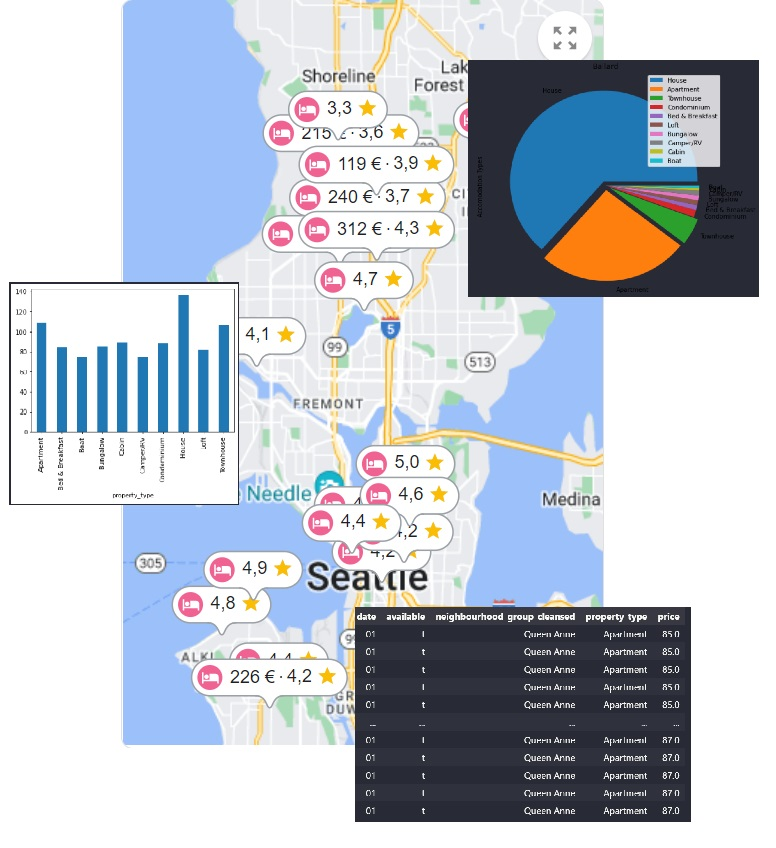
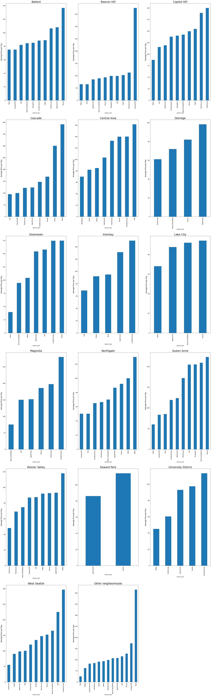
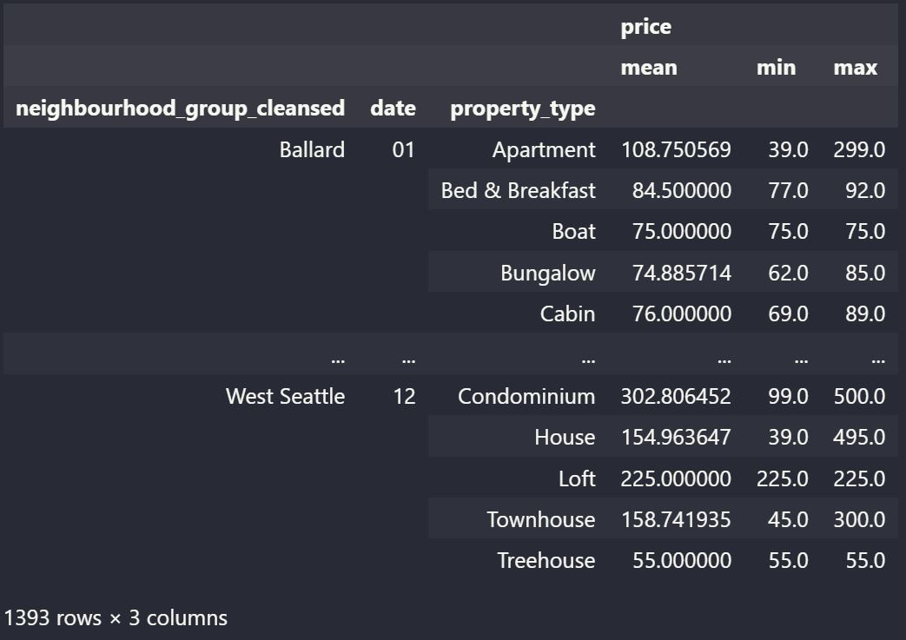
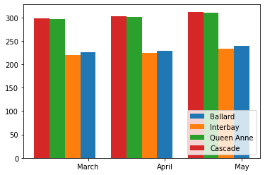
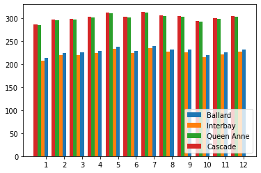

# Plan Your Seattle Accommodation the Data Scientific Way
I just started my travel to achieve the "Udacity Data Scientist Nano Degree". One of the first real life tasks there is to present data scientific results in a blog post. Based on Seattle Airbnb open datasets I did some evaluations to find out if I can can extract some useful information from this data to be used to find good fitting accomodation for a hypothetical trip of our family to Seattle.

|  |
| :--: |

## Personal Assumptions
For this hypothecial trip let us assume I wanted to travel to Seattle with my wife and three children (aged three, six and eight years). Within travel time we would like March, April or May next year.
## Goals Of Our Evalutions
Within the data set we see that besides prices and ratings also the accomadation types are available. We have never been to Seattle before and we do not yet know in which area we want to stay there and what kind of property we would like. So we first want to get an overview. When we are more certain about that we will have a look at criterias to find out the best fitting date for our travel.

## Question 1: Property Types Per Area
Let us first see, what diffrent property types are offered within the corresponding neighbourhoods.


    	
When having a look at the distribution of property types in neighbourhoods we can see, some of them are dominated by appartments (i.e. Cascade, Downtown), others by houses (i.e. Central Area, Delridge). And there are also some neighbourhoods with more fancy accomodations like boats, yurts or treehouses (i.e. Interbay, Ballard, Queen Anne, West Seattle, Rainier Valley).
## Question 2: What about Prices
Ok, nice to see what types of properties there are. But what about the prices? Can we have an overview of the average price of an accomodation of a property type per neighborhood?



From the pure scaling we already get an impression of the price structure of a neighbourhood. Looking at the details we then can retrieve the desired information about average price per type.
Hmm, feedback from family tends to point to the direction of a boat stay. All of the corresponding neighbourhoods (Interbay, Ballard, Queen Anne and Cascade) could be affordable for this. 
Maybe we can tune a bit and find out which of these four neighbourhoods has the best medium price at our possible travel dates.

## Question 3: Predict Price For Combination of Date, Property Type And Neigbourhood

For some accomodations prices might be varying over the year. Given a neighborhood, accomodation type and a date, what is the forecasted average price for it?
Looking this up from purely the consolidated and grouped data is possible but with not much fun. We do not want to read over 1400 rows!



Therefore I constructed a small linear regression model, fitted it on all the data and was now able to use the model prediction to get my desired overview.

### Diagramm for Three Months


This does look like there is no much difference within these three months. How would it like over the year?

### Diagram for Twelve Months

This is no variation that would my family convince to switch to another period. It is however hard to read the concrete numbers from this. Let's get them printed out:

```
'Month 3, Neighbourhood Ballard - average cost for Boat: 225.0',
 'Month 3, Neighbourhood Interbay - average cost for Boat: 220.0',
 'Month 3, Neighbourhood Queen Anne - average cost for Boat: 297.0',
 'Month 3, Neighbourhood Cascade - average cost for Boat: 298.5',
 'Month 4, Neighbourhood Ballard - average cost for Boat: 229.0',
 'Month 4, Neighbourhood Interbay - average cost for Boat: 224.0',
 'Month 4, Neighbourhood Queen Anne - average cost for Boat: 301.0',
 'Month 4, Neighbourhood Cascade - average cost for Boat: 302.5',
 'Month 5, Neighbourhood Ballard - average cost for Boat: 238.5',
 'Month 5, Neighbourhood Interbay - average cost for Boat: 233.5',
 'Month 5, Neighbourhood Queen Anne - average cost for Boat: 310.5',
 'Month 5, Neighbourhood Cascade - average cost for Boat: 312.0'
 ```

 So average range could be from $225 to $312 for this stay. Okay, this I will have to discuss with my family. We probably also want to have a detailed look (meaning photos not data) at the neighbourhoods.

 ## Conclusion
 For me this was my first practical application of data science. My primary goal was to get used to the available tools like Pandas and Scikit-Lear, do some evaluations and get nice diagramms. As you may have noticed - the practical value of this might not (yet) be a data science breakthrough - but overall I'm quite satisfied and eager to practice more!
 
 I do for sure recommend doing such practical oriented trainings like this one from Udacity!

