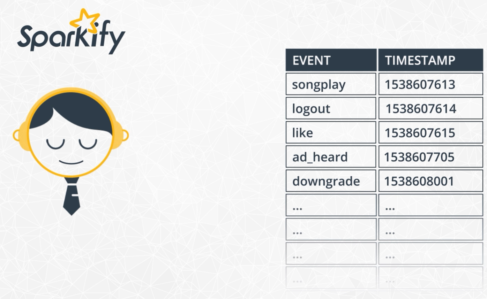

# Sparkify - Will He Go Or Will He Stay...
The final project in my journey to attain the 'Udacity Data Scientist Nanodegree' involves a challenge related to the world of music streaming providers. The objective is to make accurate predictions about users who are likely to unsubscribe from our service. This capability would allow our business to offer them special rates or incentives

|  |
| :--: |

## Our data foundation
We have a log file which contains for every user all of the user interactions together with a timestamp. Interactions could be "playing a song", "add song to playlist", "rate a song" and so on. Every log entry also contains additional information about the user's gender, location, details of the song and more. Within all of these data the information about a nearing churn of the user might be hidden.

|  |

### Structure of the data
Below is a printout of the schema of our data.
```
root
 |-- artist: string (nullable = true)
 |-- auth: string (nullable = true)
 |-- firstName: string (nullable = true)
 |-- gender: string (nullable = true)
 |-- itemInSession: long (nullable = true)
 |-- lastName: string (nullable = true)
 |-- length: double (nullable = true)
 |-- level: string (nullable = true)
 |-- location: string (nullable = true)
 |-- method: string (nullable = true)
 |-- page: string (nullable = true)
 |-- registration: long (nullable = true)
 |-- sessionId: long (nullable = true)
 |-- song: string (nullable = true)
 |-- status: long (nullable = true)
 |-- ts: long (nullable = true)
 |-- userAgent: string (nullable = true)
 |-- userId: string (nullable = true)
```
One of the most intriguing attributes is the 'page' attribute, which contains the identifiers of the pages the user has visited. From this information, we can directly retrieve user events. Below, you'll find a list of possible 'page' values.
#### Page Values / User Events
```
+--------------------+
|                page|
+--------------------+
|               About|
|          Add Friend|
|     Add to Playlist|
|              Cancel|
|Cancellation Conf...|
|           Downgrade|
|               Error|
|                Help|
|                Home|
|              Logout|
|            NextSong|
|         Roll Advert|
|       Save Settings|
|            Settings|
|    Submit Downgrade|
|      Submit Upgrade|
|         Thumbs Down|
|           Thumbs Up|
|             Upgrade|
+--------------------+
```
## The Data Preprocessing
During data preprocessing, I cleaned the data by removing rows that lacked essential information, such as at least a userId and page. Additionally, I introduced some new attributes to identify downgrades, churns, and to track the user lifecycle.

## Feature Engineering
In the feature engineering stage, I utilized both the original dataset attributes and introduced new features. The key features used to predict user quitting include:

* Gender: Male/Female/Unknown
* Location: User's residence (e.g., "Kansas City, MO-KS")

I also added useful derived features:
* Add to Playlist: Total number of songs a user added to a playlist
* Add Friend: Total number of friends the user added to their friends list
* Year_Month_Day_NextSong: Number of songs played per specific day by a user

Below is the complete feature dataframe:

### Feature Dataframe
```
+------+------+--------------------+---------------+----------+-----------------------+--------------+
|userId|gender|            location|Add to Playlist|Add Friend|year_month_day_NextSong|year_month_day|
+------+------+--------------------+---------------+----------+-----------------------+--------------+
|200002|     M|Chicago-Napervill...|              8|         4|                      8|    2018_11_16|
|200002|     M|Chicago-Napervill...|              8|         4|                     34|    2018_10_16|
|200002|     M|Chicago-Napervill...|              8|         4|                    117|    2018_10_18|
|200002|     M|Chicago-Napervill...|              8|         4|                      4|     2018_10_1|
|200002|     M|Chicago-Napervill...|              8|         4|                     20|     2018_10_2|
|200002|     M|Chicago-Napervill...|              8|         4|                     53|    2018_10_23|
|200002|     M|Chicago-Napervill...|              8|         4|                     39|    2018_10_22|
|200002|     M|Chicago-Napervill...|              8|         4|                    112|    2018_11_15|
|100010|     F|Bridgeport-Stamfo...|              7|         4|                     31|     2018_10_8|
|100010|     F|Bridgeport-Stamfo...|              7|         4|                     51|     2018_11_5|
|100010|     F|Bridgeport-Stamfo...|              7|         4|                     24|    2018_11_21|
|100010|     F|Bridgeport-Stamfo...|              7|         4|                     80|     2018_11_9|
|100010|     F|Bridgeport-Stamfo...|              7|         4|                     44|    2018_10_20|
|100010|     F|Bridgeport-Stamfo...|              7|         4|                     38|    2018_10_16|
|100010|     F|Bridgeport-Stamfo...|              7|         4|                      7|    2018_10_15|
|   125|     M|  Corpus Christi, TX|              0|         0|                      8|    2018_10_12|
|    51|     M|Lexington-Fayette...|             52|        28|                    150|    2018_10_15|
|    51|     M|Lexington-Fayette...|             52|        28|                     16|     2018_10_4|
|    51|     M|Lexington-Fayette...|             52|        28|                     20|     2018_10_3|
|    51|     M|Lexington-Fayette...|             52|        28|                    209|     2018_10_8|
+------+------+--------------------+---------------+----------+-----------------------+--------------+
```
## Modelling
I used the feature dataframe mentioned above, along with the "churned" label, as input for our model training. The data was split into a 70% training set and a 30% testing set. The training phase involved five different classifiers:

* Logistic Regression
* Random Forest
* Gradient Boosted Trees
* Support Vector Machine
* Naive Bayes

### Evaluation
Given the dataset's significant class imbalance with very few churned labels, I opted to use the F1 score for evaluation. The F1 score provides a balanced assessment of both precision (the model's ability to correctly classify positive instances) and recall (the model's ability to capture all positive instances).

Below is a table displaying the results for the different models:

|Model | F1 Score| Comment|
|-------|-----|-----|
|Logistic Regression| 0.92| Training has been performed here with 5-fold x-val over several params|
|Random Forest | 0.79| |
|Gradient Boosted Trees| 0.96| This model did perform right from the start with best F1 score. I therefore did a second try with 5-fold x-val over four different parameters.
|Support Vector Machine| 0.92|  SVM can be sensitive to feature scales. So it might be, we could even improve this result by normalizing our features (which I did not do)|
|Naive Bayes| 0.71| |

 ## Conclusion
It appears that the data indeed contains valuable information for predicting user churns. The best-performing model from my investigations achieved an impressive F1 score of 96%, which I found surprisingly high. There is potential to further enhance this performance by considering additional features, scaling the features (if pursuing SVM), or conducting more extensive hyperparameter tuning.

Personally, I thoroughly enjoyed working on this project and gained valuable experience in using Spark (my first exposure to it) and handling big data processing in general.


